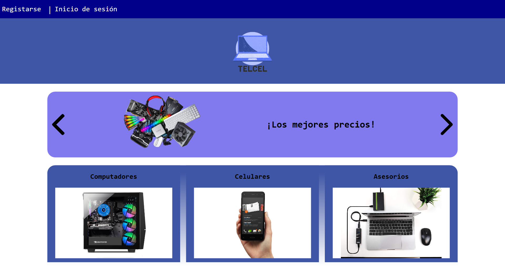

#__Telcel__

**Proyecto que intenta emular un e comerce utilizando biblioteca de clases con el lenguaje de c# ademas de windows forms presentation Utilizando la arquitectura de tres capaz para la realizacion del proyecto.**

__Uso de a libreria livechart para generar diagramaas de barras y diagramas pastel__

